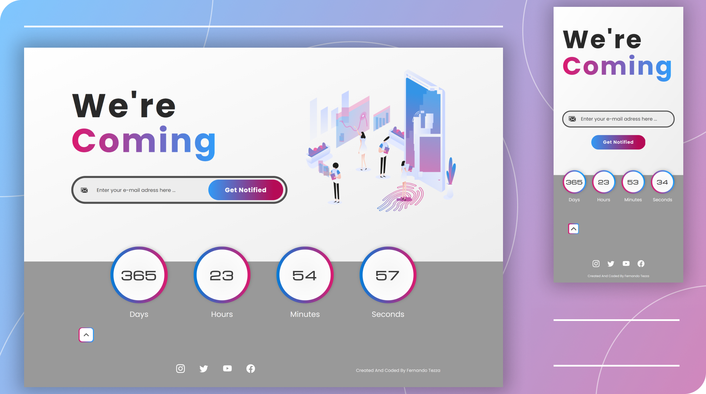

# Coming Soon Page With Countdown 

(Página de Em Breve com Contagem Regressiva) \
Esse é um projeto pessoal de uma Landing Page com contagem regressiva para usar em qualquer evento.

## Índice

- [Overview](#overview)
  - [Sobre](#sobre)
  - [Funcionalidades](#funcionalidades)
  - [Layout](#layout)
    - [Layouts Desktop e Mobile](#layouts-desktop-e-mobile)
    - [Design - Protótipos](#design-protótipos)
  - [Demonstração](#demonstração)
  - [Ferramentas](#ferramentas)
- [Autor](#autor)
- [Licença](#licença)

## Overview

### Sobre

Status: Concluído\
O propósito desse projeto é praticar UI design (design de interface - usando Figma) e habilidades de desenvolvimento front end. É uma landing page simples de uma página de "Em Breve" que executa um contador regressivo (para a data e hora selecionadas pelo usuário).

### Funcionalidades
- [x] Os usuários devem conseguir
   - [x] visualizar o layout de acordo com o tamanho de tela do dispositivo
   - [x] visualizar a tela do modal, que deve ser aberta automaticamente se o usuário não clicar no botão de abrir/fechar (5 segundos após o carregamento da página)
   - [x] selecionar uma data e uma hora para ativar a animação de contagem regressiva, usando a interface do modal 
   - [x] abrir e fechar o modal quando quiserem
   - [x] parar e apagar o contador ao clicar no botão "Stop" ou quando fecharem a janela do website
   - [x] simular uma assinatura de lista de e-mail: ao digitar o endereço de e-mail no formulário, uma mensagem deve aparecer para avisar o usuário se o e-mail digitado possui um formato válido ou não  

### Layout

#### Layouts Desktop e Mobile

#### Design Prototypes

[Design e Protótipos disponíveis no Figma](https://www.figma.com/file/z7OHMZDHZgmwVersdstHmA/ComingSoon?node-id=9%3A127)

### Demonstração
[URL do Site de Demonstração](https://devtezza.github.io/coming-soon)

### Ferramentas

Layout:
- [Figma](https://www.figma.com) - para wireframes, design e protótipos
- [Reshot](https://www.reshot.com/) - para a ilustração da seção Hero do website

Ícones:
- [SVG Repo](https://www.svgrepo.com/) 
- [Feather Icons](https://feathericons.com/)
- [Bootstrap Icons](https://icons.getbootstrap.com/)

Código:
- HTML5, CSS3 e Javascript

Bibliotecas:
- [SASS](https://sass-lang.com/) - Pré-processador de CSS3
- [Flatpickr](https://flatpickr.js.org/) - Uma biblioteca Javascript para gerar um seletor de data e hora
- [Validator JS](https://github.com/validatorjs/validator.js/) - Uma ferramenta com vários validadores de string. Eu usei o validador de e-mail
- [Greensock (GSAP)](https://greensock.com/) - Famosa biblioteca Javascript de animação.Nesse projeto, foi usada para construir a animação do contador e para as transições exibidas quando o usuário abre/fecha o modal

## Autor

[Fernando Tezza](https://github.com/devtezza) 
[Linkedin](https://www.linkedin.com/in/devtezza/)  |  [Frontend Mentor](https://www.frontendmentor.io/profile/devtezza)

## Licença

This project está sob a licença [MIT](./LICENSE)

## Versões do README 
[Português](./README-pt-br.md)  |  [Inglês](./README.md)