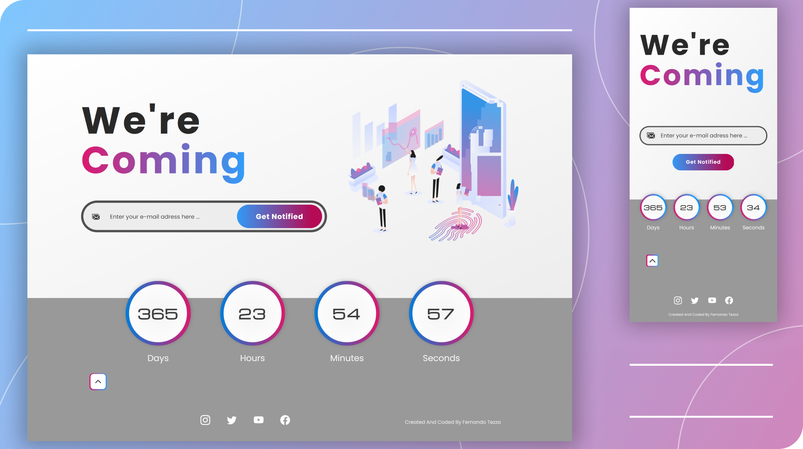

# Coming Soon Page With Countdown

This is a personal project of a Landing Page with a countdown to be used for any event.

## Table of contents

- [Overview](#overview)
  - [About](#about)
  - [Features](#features)
  - [Layout](#layout)
    - [Desktop And Mobile Layouts](#desktop-and-mobile-layouts)
    - [Design And Prototypes](#design-and-prototypes)
  - [Live Site](#live-site)
  - [Tools](#tools)
- [Author](#author)
- [License](#license)

## Overview

### About

Status: Finished\
The purpose of this project is to practice UI design (using Figma) and front end development skills. It's a simple coming soon landing page that runs a countdown to the date and the time selected by the user. 

### Features
- [x] Users should be able to:
   - [x] view the layout according to the device's screen size
   - [x] view the modal screen, which has to be automatically open if they don't click the toggle button (5 seconds after the page is loaded) 
   - [x] select a date and a time to activate the countdown animation, by using the modal screen interface
   - [x] open and close modal screen whenever they want
   - [x] stop and clear the counter by clicking the "Stop" button or when they close the website's window
   - [x] simulate a newsletter subscription: when they enter an e-mail address on the submit form, a message must appear in order to notify the user if they typed a valid e-mail format or not

### Layout

#### Desktop And Mobile Layouts

#### Design And Prototypes

[Design Prototypes available on Figma](https://www.figma.com/file/z7OHMZDHZgmwVersdstHmA/ComingSoon?node-id=9%3A127)

### Live Site
[Live Site URL](https://nandotezza.github.io/coming-soon)

### Tools

Layout:
- [Figma](https://www.figma.com) - for wireframes, design layouts and prototypes
- [Reshot](https://www.reshot.com/) - for the Website's Hero Section Illustration

Icons:
- [SVG Repo](https://www.svgrepo.com/) 
- [Feather Icons](https://feathericons.com/)
- [Bootstrap Icons](https://icons.getbootstrap.com/)

Code:
- HTML5, CSS3 and Javascript

Libraries:
- [SASS](https://sass-lang.com/) - CSS3 Preprocessor
- [Flatpickr](https://flatpickr.js.org/) - A Javascript library to generate date and time picker interface
- [Validator JS](https://github.com/validatorjs/validator.js/) - A tool with lots of string validators. I used the e-mail validator
- [Greensock (GSAP)](https://greensock.com/) - A famous Javascript animation library. In this project, it was used to build the counter's animation and the transitions that are displayed when the user open/close the modal screen

## Author

[Fernando Tezza](https://github.com/nandotezza) \
[Linkedin](https://www.linkedin.com/feed/)  |  [Frontend Mentor](https://www.frontendmentor.io/profile/nandotezza)

## License

This project is under the license [MIT](./LICENSE)

## README Versions
[Portuguese](./README.md-pt-br)  |  [English](./README.md)